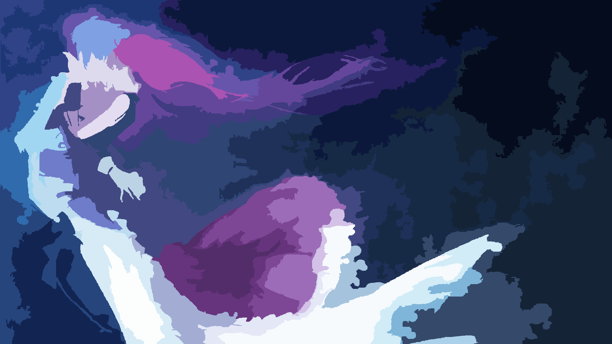
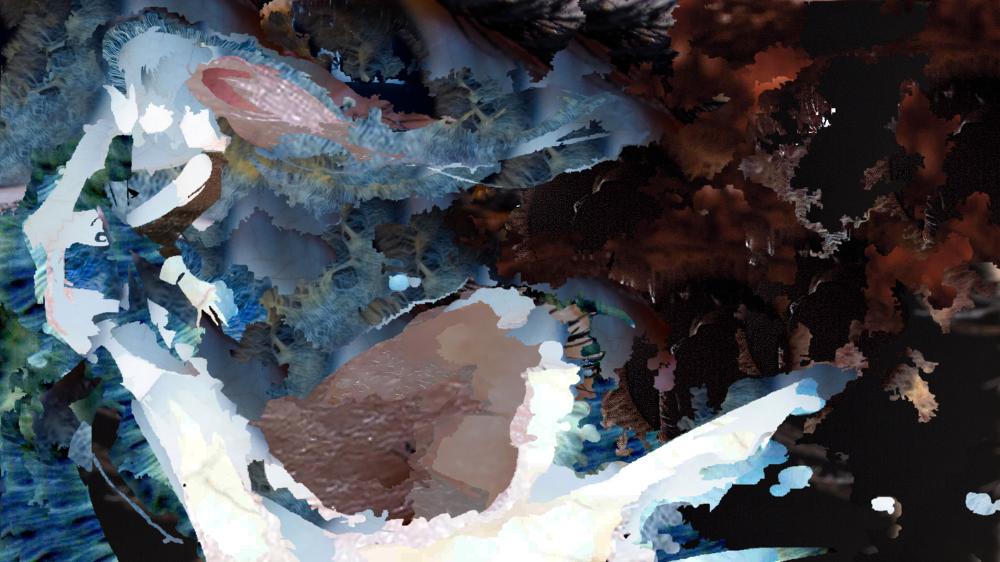
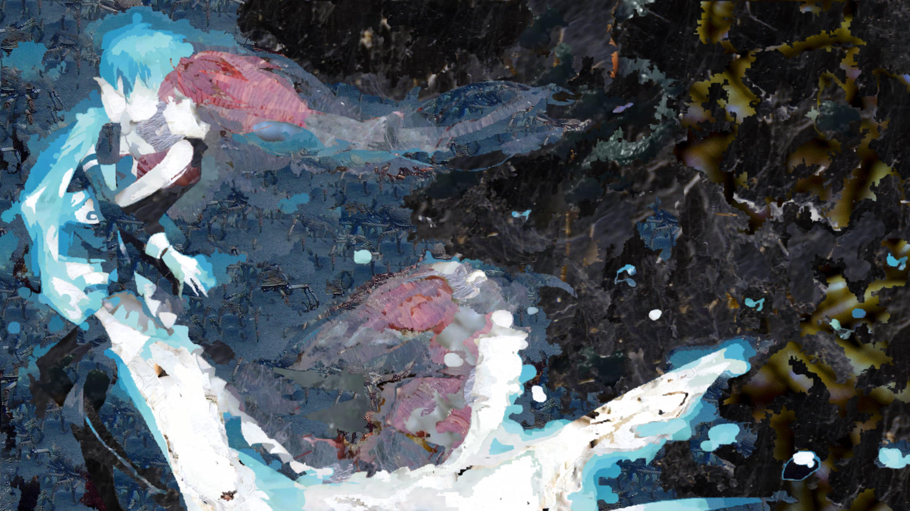
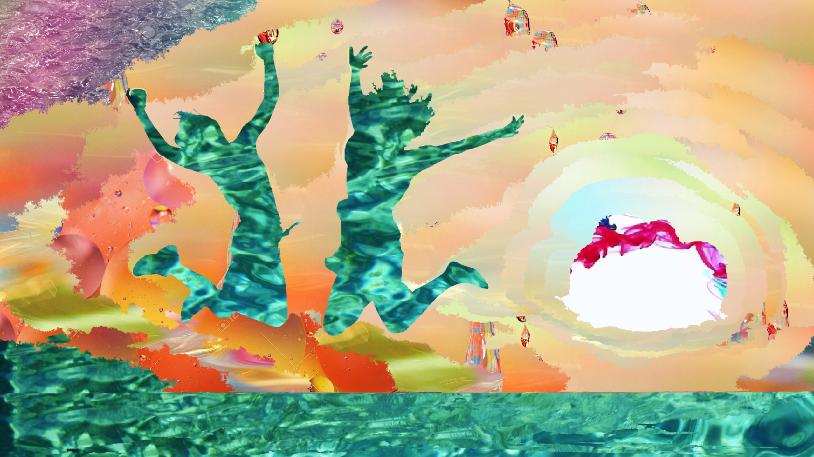
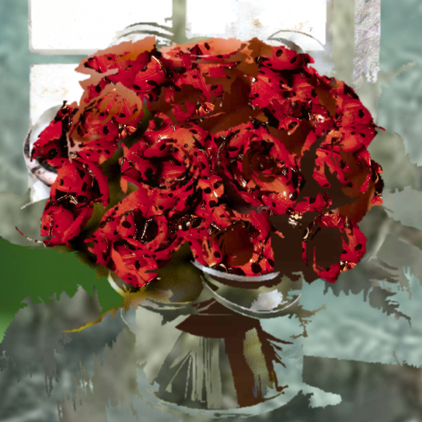
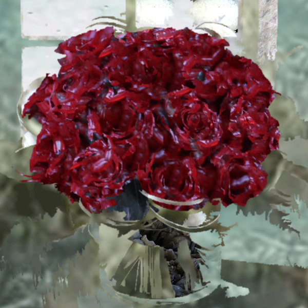
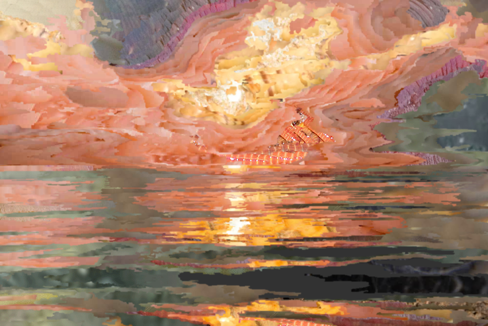

## Table Of Contents:
- [What is this project about?](#what-is-this-project-about)
  - [What's the point?](#whats-the-point)
- [Overview of included projects](#overview-of-included-projects)
- [Quickstart/Setup](#quickstart--setup)
- [ImageSimplify](#about-imagesimplify)
  - [Algorithm Design](#algorithm-design)
  - [General Usage](#general-usage)
  - [Arguments](#optional-arguments)
- [ImageComp](#about-imagecomp)
  - [Algorithm Design](#algorithm-design-1)
  - [General Usage](#general-usage-1)
  - [Arguments](#optional-arguments-1)
- [ImageInterface](#about-imageinterface)
- [SharedLib](#about-sharedlib)
- [.regdata format](#the-regdata-file-format)
- [Future Plans](#future-plans)

# What is this project about?
Functionally this project basically has two goals:
1. Generate simplified versions of images where the image is represented as a set of uniformely colored connected regions
2. Generate composition versions of images where the original image is represented through a set of smaller images. To generate this "composition" the region-data from the previous step is used. Each connected region is used as a mask for a sub-image used in the composition.

 (Disclaimer: All images used here were collected from the web and credit goes to their respective authors)

To give some visual examples, here's an unedited image:


And here is the same image simplified down to 40 regions:


Switching over to the image composition tool, here's the same base image, split into 100 regions, composed using an image-set of eyes:


Another composition example of the same image, this time with 400 regions and an image-set of "creepy" things (mainly featured here are crabs, worms, and a spiderweb):


And a couple more image-composition examples:





#### Note
The results you get vary a fair bit with the chosen region-count and sub-image library used.
Although the tool is "automatic" in a sense, there are a lot of input parameters you can adjust.

## What's the point?
I created this project out of personal interest and the desire to create composition images that contrast a pretty overall image with unpleasant or unnerving sub-components.
(which is why many of the examples images use stuff like worms as the sub-image set)\
The Image-Simplification tool was just a pre-processing step I created for the composition part, but I actually quite like some of the results you can get from simplification directly.\
You can often find a sweet-spot where an image is still well recognizeable while using far fewer regions and there is a beauty in the simplicity.

So to answer the question, I like the kind of results you can get from it and thought others might enjoy it too.
That said, beauty is subjective so I totally understand if some people just think the results look strictly worse than the originals.

# Overview of Included Projects
The code for this repository is part of a VS2019 solution that contains multiple projects.
The code is written in C++ and the projects are targetted for 64 bit Windows. (though you should be able to make a 32bit build with only minor modifications)
Both tools are command-line based, there is no GUI.

The included projects are:
 - ImageSimplify
 - ImageComp
 - SharedLib (static library referenced by ImageSimplify & ImageComp)
 - ImageInterface (dll used by ImageSimplify & ImageComp at runtime to read & write images)

# Quickstart / Setup
Currently the project requires you to have ImageMagick installed (https://imagemagick.org/script/download.php) and visible on your PATH.
If you want to remove this dependency you can compile your own version of ImageInterface.dll to handle images.

I will upload some pre-compiled binaries. If you don't want to compile the project yourself, just download those.\
If you wish to test them on some known data, download the repo as well, place the binaries into the "AggregateBuild" folder, and run the scrips from the "TestScripts" subfolder.

Otherwise, download the repo, open the solution, and build projects for Release/x64.\
ImageSimplify.exe and ImageComp.exe can operate independantly and are thus placed in seperate build folders initially.\
You can run collectFiles.bat to copy the relevant binaries to the AggregateBuild folder.\
As mentioned before, use the scripts from the "TestScripts" subfolder to test the tools using commands & data that should work.

# About ImageSimplify:
The goal is to create a perceptually "simplified" version of the original image by representing it using a set of uniformly colored connected regions.

## Algorithm Design:
In more technical terms, the goal/problem is:
```
Given: An image and a positive integer N
Produce: Produce an image of equal dimensions that consists of N uniformly colored connected regions, such that the "color error" is minimal

Where "Color error" is defined as the sum of color differences between each input-output pixel pair.
The method of computing "color difference" I'm using is to convert to the LAB space and taking the euclidean distance between color vectors.
```

To achieve this I'm using a greedy algorithm that generates succesively simpler images.\
Pseudo-Code:
```
For the input image consider each pixel it's own region
curRegions = width*height
while curRegions > N:
	Merge a pair of neighbouring regions such that the "color error" is minimal
		The color of new region is the average color of the pixels within it
```

This algorithm doesn't generate the true error-minimal solution to the presented problem but the results are pretty good.

#### Small Adjustment:
The above algorithm isn't strictly true because the region-merge error function is written to slightly prefer merging small regions.\
Ultimately I'm after results that *look* nice to me and I prefered the results after this adjustment.\
(error function is `getColorDiff(r1,r2)` in Region.cpp)


## General Usage:
`ImageSimplify <target-file> [optional arguments]`

If the target file was named "testImage.jpg", then by default the tool will generate the following folder structure
```
Output/
  testImage/
    regData/
      testImage_1.regdata
      testImage_2.regdata
      ...
    ArgsUsedToGenerate.txt
    testImage_1.jpg
    testImage_2.jpg
    ...
```

So there's the general folder with the simplified images and regData sub-folder with the regdata files.
ArgsUsedToGenerate.txt is a one-line file that just lists the last command used to generate the files.\
(This file only gets written to. It is just something I found useful to keep track of things)

Although the above example suggests that a file is output for every simplification level, that is not correct.\
The idea is to take a snapshot of each simplification stage that looks faily distinct. Snapshots get taken
at region counts:
```
1, 2, 3, 4, 5, 6, 7, 8, 9
10,20,30,40,50,60,70,80,90
100, 125, 150, 175 ... 500	(100->500 range breaks the pattern and outputs every 25)
500, 600, 700, 800, 900
1k, 2k, 3k, 4k, 5k, 6k, 7k, 8k, 9k
etc.
```

#### Note about target-file argument:
You can also specify a .regdata file to start the simplification process from.\
If the .regdata file-name has the format `<something>_<number>.regdata` and "outFilename" is not set then outFilename will be set to <something>\
(ie. You can target a previously generated regdata file without any issues)
	
## Optional arguments:

### outFilename
Base-name used for generating output files\
Output files are named:
`<base-name>_<regionCount>.<regdata OR jpg>`

By default this base-name is generated from the input file.

### outputFolder
General folder for storing output. "Output" by default.\
For each file processed, an output sub-folder is created.\
If you process `<something>.jpg`, the results will be placed in `<outputFolder>/<something>`

### stopAt
The region-count to stop the simplification process at.\
The regdata will always be output for this region-count.
1 by default

### outputAfter
Maxmimum region-count for which to generate files.\
The simplification isn't particularly noticeable until there are less than 1000 regions
so this is set to 1000 by default

### -regDataOnly (flag)
If set, only the .regdata files will be generated

### scale
This is a convienence option for running the algorithm on a lower-res verson of the image.\
With a scale of S, the input image is scaled down by a factor of S, processed, and then scaled up again.

### weightMap + weightMult
Apart from trying to compute an "error minimal" simplification according to the above specification
it can be interesting to personally exert some control over which areas of an image are simplified heavily or lightly.\
For example if you had an image of a person in front of a busy background you might want the person to be represented
with more regions than the background since they are more important to the viewer.

To this end there is an option to provide custom weights to the pixels in the target image.\
The "weight" of a pixel/region acts as a multiplier to the color-error that is calculated.\
(By default each pixel has a weight of 1 and each region a weight equal to the number of pixels in it)
Intuitively, the "weight" of a region dictates how readily it will merge with neighboring regions.\
A region of the image with relatively high weight will be broken up into more regions.

To specify these weight values two parameters are used. A greyscale image referered to as a "weight-map" and a scale value
refered to as "weightMult".
`	weight(x,y) = 1 + weight-map(x,y).brightness * weightMult`

ie. A black pixel assigns a weight of 1, a white pixel assigns a weight of 1 + weightMult

Note: The weight-map image does not technically have to be greyscale but it will internally be converted to greyscale before use


### contrastMap + contrastMult
Another control method available is adding a "contrast-map"\
The idea behind this option is to make certain regions of the image less likely to merge.

As with the weight-map, a contrast-map image is supplied as well as a scaling value called contrastMult.\
Internally the algorithm essentially runs on both two images (main-target + contrast-map) in parralel.\
Only one set of regions is used, but each region tracks a color for the target image as well as the contrast-map
and the color-error from both images is used to determine which regions are merged.


# About ImageComp:
	
## Algorithm Design
ImageComp takes 3 arguments:
  1. A target image to be represent through a composition of sub-images
  2. A regdata file that determines the regions used for the composition
  3. A collection a sub-images to be used for the composition

For each region of the target image, a sub-image is picked for which a "region-paste"
is performed. A "region-paste" copies data from a sub-image into the pixels of a region.\
(ie. If the region is a circle a circular region of the sub-image is cut-out and pasted onto that area of the target-image)\
Similar to the simplify algorithm, a "color-error" function is used to determine which sub-image most closely matches the region.\
Here the "Color-Error" function used is the manhattan distance between colors in the RGB space.\
This is chosen due to it's simplicity and fact that the error for each color channel can be
computed seperately.

Although not explicitly mentioned above, when chosing a sub-image to "paste" an offset also needs to be considered.\
For example, lets say that we have a region with a bounding box of 100x100\
In order to cover the whole region cleanly we need an image that's at least 100x100\
However if we have an image thats 200x150 then there are additionally 100*50 = 5000 possible
offsets we could use.

For the sake of conceptual simplicity, each offset-image is considered a seperate image.\
So, how do we deal with image collections that can easily have over 10k items?\
Two methods are used:
  1. Instead of considering every possible offset we only consider certain increments (currently increments of 4*8=32)
  2. Statistical methods are used to narrow down the candidate image pool

For method 2 images are broken up into 8x8 "tiles" and for each color-channel in each tile the normal distribution is tracked (mean & variance).
When comparing two tiles we can operate on these distributions directly to quickly calculate a distribution for the expected color-error.
And by adding up distributions we can quickly determine the expected color-error for two tiled images.
Then we calculate the 80 percentile region of the distribution to determine a minimum and maximum probable error. Any image that has a min-error greater than the lowest max-error is discarded.

A side-effect of method 2 is that the initial tile distributions for each library image only
need to be calculated once and can be cached for future use.

Once the potential image-set has been narrowed down, the error for the remaining images is directly calculated.

## General Usage:
`ImageComp <source-image> <regdata> <sub-image-folder> <output-path>`

By default running the command will create a "cache" folder in the current directory that will contain some pre-computed data on the sub-image library used.\
(Note: The sub-image folder is searched recursively)

## Optional Arguments:

### cache
Path to directory for writting&reading cache data.\
"./cache" by default

### -ignoreCache (flag)
If included no cache data is read or written. All necessary data is computed on the fly.

### tileSize
Size of tiles to use for distribution heuristic. 8 by default (ie 8x8 tiles).\
Cached data is tile-size specific so when switching to a new tile-size the used library will need to be re-processed.

# About ImageInterface:

This project generates a dll called ImageInterface.dll with three methods:
```
	bool canProcess(const char* path)
	uint8_t* readData(const char* path, int* width, int* height)
	void writeData(const char* path, width, height, uint8_t* data)
```

The methods are fairly self-explanatory.\
The pixel data is stored in an sRGB format in a uint8_t array\
Each pixel consists of the 4 values: red, green, blue, alpha\
Pixels are written left to right, bottom to top.

`canProcess` is called on any potentially used path before readData or writeData are called and is mainly used to check whether a given file-type is supported.

This dll is dynamically loaded without any compile-time linkage.\
The idea is that the dll can be swapped out for something else if desired
without needing to recompile any of the other projects.

## About the alpha-channel
Currently the tools don't actually use the alpha value at all. All pixels are considered fully opaque.\
However for the sake of future compatiblity the dll should handle the alpha channel as well.\
That way if it later gets used the dll won't need to be updated.

## Current Implimentation
The currently supplied ImageInterface project relies on a local ImageMagick installation.\
The "magick" tool is used to convert files to & from the BMP format for which the DLL has limitted built-in support.\
(Not all variants of BMP are supported but magick should only produce BMP files that the DLL can read)

Temporary files are used to pass data to and from magick.exe

# About SharedLib
SharedLib is a statically linked library used by the Simplification and Composition project.\
It just contains whatever classes I found myself wanting to re-used between the two projects.

# The .regdata file format:
Region data is stored in ".regdata" files.\
Currently all numeric values are stored as 4-byte unsigned integers

Format specification (version 5):
```
	version-number
	uncompressed-block-size
	compressed-block-size
	<compressed-data-section> (compressed-block-size bytes long)
```

The data-section is compressed using zLib (default compression level)\
When uncompressed, the data-section has the following format:
```
	region-count
	width
	height
	Region Colors: (region-count entries)
		red-val
		green-val
		blue-val
	Index List: (width*height entries. Each entry corresponds to a pixel listed left->right bottom->top)
		region-idx
```

Regardless of any future changes, the first 4 bytes will always be the version number.

RegData files don't contain a reference to the image they were generated from, so they need to be stored and/or named in a way that makes the association clear.

The RegData class in the SharedLib project contains the actual code for reading/writing the file format.

# Future Plans
The code is pretty functional at the moment but there is still more stuff I might add.

Mainly I think the ImageComp tool could use a bit more work.\
There are a few more command-line options I can add and I'd also like it to output a "recipe" for a composed image that simply lists: The source-path, The regdata-path, and for every region which sub-image was used at which offset.\
This "recipe" file can then be used by other programs to quickly reconstruct the composition image and would allow for simple changes like target file format (without data loss)

I was also planning on adding a tool for miscelanous operations.\
For example it's easy to create an image from an existing regdata file, no need to run the whole simplification process.

I also have some code for smoothing out the borders for a set of regions which currently isn't incorperated into the simplification tool.
	
